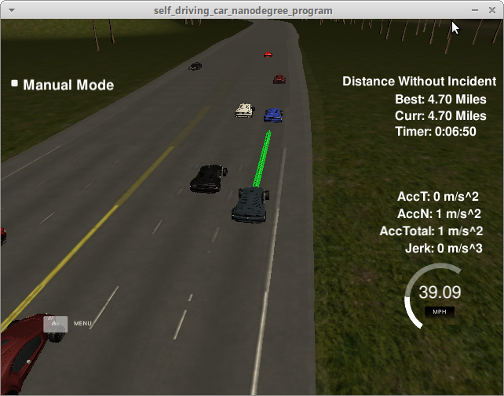

# Path-Planning Project
[](http://www.udacity.com/drive)

Overview
---
This repository contains my implementation of the Path-Planning project (Term 3 - Project 1) in Udacity's Self-Driving Car Nanodegree Program.

### Goals
In this project your goal is to safely navigate around a virtual highway with other traffic that is driving +-10 MPH of the 50 MPH speed limit. 
You will be provided the car's localization and sensor fusion data, there is also a sparse map list of waypoints around the highway. 
The car should try to go as close as possible to the 50 MPH speed limit, which means passing slower traffic when possible, note that other cars will try to change lanes too. 
The car should avoid hitting other cars at all cost as well as driving inside of the marked road lanes at all times, unless going from one lane to another. 
The car should be able to make one complete loop around the 6946m highway. 
Since the car is trying to go 50 MPH, it should take a little over 5 minutes to complete 1 loop. 
Also the car should not experience total acceleration over 10 m/s^2 and jerk that is greater than 10 m/s^3.

## Implementation (Rubric Points)

### General
A finite state machine with seven different states is used to navigate the car safely through traffic. 
The state transitions are selected by evaluating the cost functions for all possible successor states and 
chosing the one resulting in the minimum cost.


The following states are defined:

| State         | Discription | 
| ------------- |-------------| 
| KL     |Keep Lane | 
| KLSU     |Keep Lane Speed Up   |   
| KLSD     |Keep Lane Speed Down   |   
| PLCL     |Prepare Lane Change Left  |   
| PLCR     |Prepare Lane Change Right  |   
| LCL     |Lane Change Left  |   
| LCR     |Lane Change Right  |   


The `PID` class from Term 2 was used in order to control the throttle of the car.
The parameters are set to `P=0.05`, `I=0.02` and `D=0`.
The error-input of the PID conroller is difference between the current car speed and the car's target speed.
The `next waypoints` are then spaced accordingly to the output of the PID-controller.

The cost-function of the individual states is implemented in `cost.cpp`.
Choosing reasonable weights for the individual situations was already a challange for this small amount of states.

The Prepare-Lane-Change States already change the lane of the car and the car then stays in the Lane-Change state until the target is reached.
During this states, the car does not check for close vehicles. Hence collisions may be possible during the lane transition - if the other vehicles behave in an unexpected way.

KLSU sets the car to the maximum allowed speed if there is enough space in front of the car. 
KLSD decreases the speed to a similar speed as the leading vehilce. 

The `vehicle` class keeps track of the vehicle-related simulator values as well as some vehicle-state values. 
This class is used to determine the best possible successor state. 


### The code compiles correctly.
The code consists of the `main.cpp`, the `cost`, `vehicle` and `PID` classes as well as the `spline.h` header-file for spline interpolation. 
The `CMakeLists.txt` was modified in order to also include the added files to the build process. 


### The car is able to drive at least 4.32 miles without incident.

As seen in the screenshot below, the implementation was able to successfully complete one lap on the track. 
  


### The car drives according to the speed limit.
The maximum speed is set to 49.5 mph and the PID controller prevents the car to exceed this limit. 

### Max Acceleration and Jerk are not Exceeded.
Using the PID controller, the previous points and the spline interpolation the accelaration and jerk limits are not exceeded. 

### Car does not have collisions.
If there is a car in front of the vehilce, the car will try to change lanes. 
If the neighboring lanes are busy, the car slows down in order to not hit the leading vehicle. 

### The car stays in its lane, except for the time between changing lanes.
This is done by calculating some anchor waypoints on the specified lane and interpolating those points using splines.
The implementation of this part is based on the project walkthrough of the project page. 

### The car is able to change lanes.
If the current lane is occupied by a slowly moving vehicle, the car changes lanes in order to pass it. 
In this case the following anchor points are chosen to be on the next lane. 
The spline interpolation and the spacing of the anchro points makes sure that the maximum accelarations are not exceeded. 


## Etc.

### Basic Build Instructions

1. Clone this repo.
2. Make a build directory: `mkdir build && cd build`
3. Compile: `cmake .. && make`
4. Run it: `./path_planning`.

### Dependencies

* cmake >= 3.5
 * All OSes: [click here for installation instructions](https://cmake.org/install/)
* make >= 4.1
  * Linux: make is installed by default on most Linux distros
  * Mac: [install Xcode command line tools to get make](https://developer.apple.com/xcode/features/)
  * Windows: [Click here for installation instructions](http://gnuwin32.sourceforge.net/packages/make.htm)
* gcc/g++ >= 5.4
  * Linux: gcc / g++ is installed by default on most Linux distros
  * Mac: same deal as make - [install Xcode command line tools]((https://developer.apple.com/xcode/features/)
  * Windows: recommend using [MinGW](http://www.mingw.org/)
* [uWebSockets](https://github.com/uWebSockets/uWebSockets)
  * Run either `install-mac.sh` or `install-ubuntu.sh`.
  * If you install from source, checkout to commit `e94b6e1`, i.e.
    ```
    git clone https://github.com/uWebSockets/uWebSockets 
    cd uWebSockets
    git checkout e94b6e1
    ```

### Highway Map
The map of the highway is in `data/highway_map.txt`
Each waypoint in the list contains  [x,y,s,dx,dy] values. x and y are the waypoint's map coordinate position, the s value is the distance along the road to get to that waypoint in meters, the dx and dy values define the unit normal vector pointing outward of the highway loop.
The highway's waypoints loop around so the frenet s value, distance along the road, goes from 0 to 6945.554.

### Simulator Data

#### Main car's localization Data (No Noise)

["x"] The car's x position in map coordinates

["y"] The car's y position in map coordinates

["s"] The car's s position in frenet coordinates

["d"] The car's d position in frenet coordinates

["yaw"] The car's yaw angle in the map

["speed"] The car's speed in MPH

#### Previous path data given to the Planner

["previous_path_x"] The previous list of x points previously given to the simulator

["previous_path_y"] The previous list of y points previously given to the simulator

#### Previous path's end s and d values 

["end_path_s"] The previous list's last point's frenet s value

["end_path_d"] The previous list's last point's frenet d value

#### Sensor Fusion Data, a list of all other car's attributes on the same side of the road. (No Noise)

["sensor_fusion"] A 2d vector of cars and then that car's [car's unique ID, car's x position in map coordinates, car's y position in map coordinates, car's x velocity in m/s, car's y velocity in m/s, car's s position in frenet coordinates, car's d position in frenet coordinates. 
